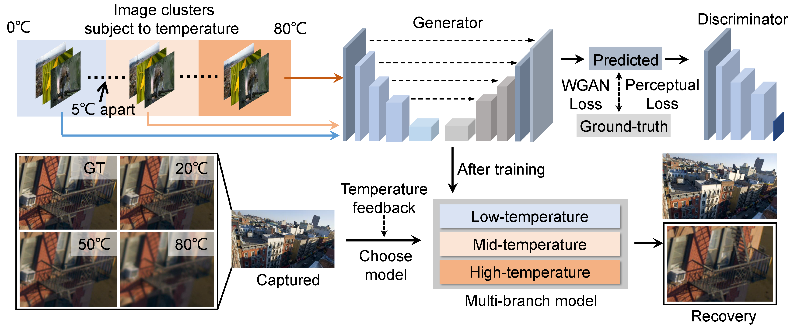

# Temperature-robust Learned Image Recovery for Shallow-designed Imaging Systems
Official Implementation of the Paper "Temperature-robust Learned Image Recovery
for Shallow-designed Imaging Systems" \
Wei Chen, Bingyun Qi, Xu Liu, Haifeng Li, Xiang Hao, and Yifan Peng*

Wei Chen, Bingyun Qi, Xu Liu, Haifeng Li, Xiang Hao \
College of Optical Science and Engineering, Zhejiang University, Hangzhou, China

Yifan Peng \
Department of Electrical and Electronic Engineering, The University of Hong Kong, Hong Kong, Hong Kong

[Official Publication](https://onlinelibrary.wiley.com/doi/10.1002/aisy.202200149)

If you have any questions, please directly comment on GitHub or through email: evanpeng@hku.hk, 22030006@zju.edu.cn, 22030056@zju.edu.cn.

# Instruction

A temperature-robust, multibranch computational imaging modality is developed, 
using generative adversarial networks as the postprocessing to compensate for 
degradation of all kinds caused by thermal defocus and noise in shallow-designed 
imaging systems. With the temperature division and dataset mixture, the proposed 
multibranch scheme outperforms traditional athermalization and is beneficial to 
lowering the design and manufacturing cost of the imaging system.

## Prepare dataset
**1**. Download the dataset and crop the image size

    We assign 612 images as our training dataset and some ones as the test set from the [Adobe5K dataset](https://data.csail.mit.edu/graphics/fivek/), and 
resize them to 1920*1080 to match the common sensor specifications of these vehicle lenses. 

**2**. Generate datasets belongs to different temperatures

    In "PSF_convolution_simulation/PSF_convolution.m", we split the ground truth into a sequence of concentric rings to match PSFs in the corresponding field of view, and then convolve
them with corresponding PSFs and add the Gaussian noise to simulate sensor responses. Among them of "PSF_convolution_simulation/PSF_info", the PSFs at different temperatures are obtained by the thermal
analysis function of the OpticStudio.

**3**. Construct the training pairs

    Run the file "train_multi_branch\generate_aligned_dataset.py" to construct the training pairs, where the GT and simulated images are in distinct folders.
     
## Training the network
   
   We refer the code from [DeblurGAN](https://github.com/KupynOrest/DeblurGAN), and modify the network architecture for our demands.
   Conda creates your environment using "train_multi_branch\pytorch36cuda11.yml". 
   
   train example:
   
    python train.py --dataroot ./datasets/ --model content_gan --layers 4
   
   where,  set '--layers' to 4, 5 or 6 indicates the scale of the Generator. In this paper, we set '--layers 4 --ngf 32' to compress the network.

## Test the trained network
   We give the multi-branch checkpoints and the test sets used in this paper. Where, "train_multi_branch\checkpoints" contain two kinds of models from simulation results on a vehicle lens and real-capture results on a phone lens. 
Based on the temperature detectors, the user can detect the temperature and invoke the corresponding branch model to recover the measured images. 

   test example:
    
    python test.py --dataroot ./datasets/test --results_dir ./dataset/results --model test --dataset_mode single  --name carlens_0_40degree --which_epoch latest

## Results
    
   
   
   
   The GIF images are compressed so that the details are not obvious, see "paper_image/simulation.mp4" and "paper_image/real_capture.mp4" for clear details.
   

## Citation
   If you find our code helpful in your research or work please cite our paper.
   
    @article{https://doi.org/10.1002/aisy.202200149,
    author = {Chen, Wei and Qi, Bingyun and Liu, Xu and Li, Haifeng and Hao, Xiang and Peng, Yifan},
    title = {Temperature-Robust Learned Image Recovery for Shallow-Designed Imaging Systems},
    journal = {Advanced Intelligent Systems},
    volume = {4},
    number = {10},
    pages = {2200149},
    keywords = {computational imaging, deep learning, generative adversarial networks (GANs), multibranch models, temperature-robust imaging},
    doi = {https://doi.org/10.1002/aisy.202200149},
    url = {https://onlinelibrary.wiley.com/doi/abs/10.1002/aisy.202200149},
    eprint = {https://onlinelibrary.wiley.com/doi/pdf/10.1002/aisy.202200149},
    abstract = {},
    year = {2022}
    }
